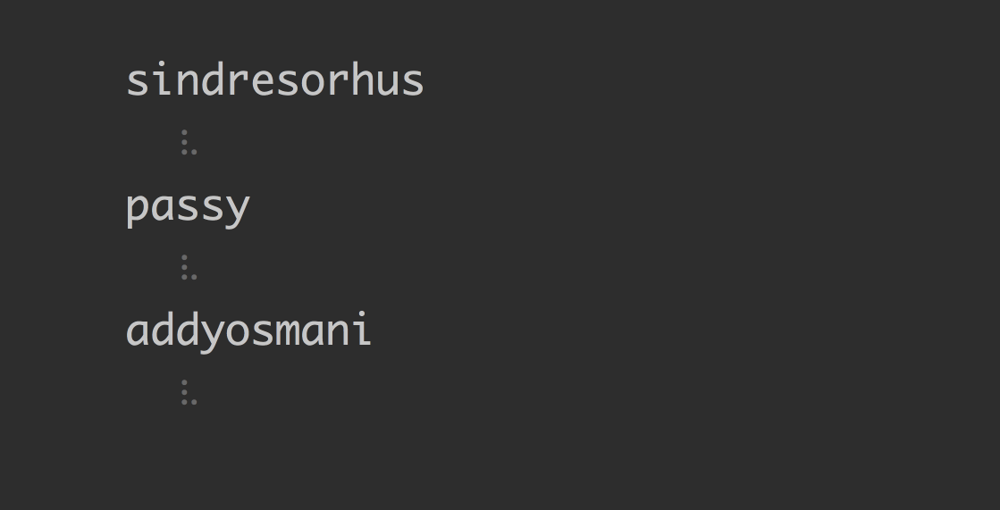

# dev-time-cli [](https://travis-ci.org/SamVerschueren/dev-time-cli)

> Get the current local time of a GitHub user.




## Install

```
$ npm install --global dev-time-cli
```


## Usage

```
$ dev-time --help

  Usage
    $ dev-time <user> <user2> ...

  Options
    -v, --verbose  Show UTC offset.
    --format       The moment format of the output. [Default: HH:mm - D MMM. YYYY]
    --token        The GitHub authentication token.

  Examples
    $ dev-time SamVerschueren
    19:47 - 8 Dec. 2015

    $ dev-time SamVerschueren sindresorhus
    SamVerschueren
      19:47 - 8 Dec. 2015
    sindresorhus
      18:47 - 8 Dec. 2015

    $ dev-time SamVerschueren -v
    19:47 - 8 Dec. 2015 - UTC+1

    $ dev-time SamVerschueren --format DD-MM-YYYY
    07-12-2015
```


## Related

- [dev-time](https://github.com/SamVerschueren/dev-time) - API for this module


## License

MIT © [Sam Verschueren](http://github.com/SamVerschueren)
